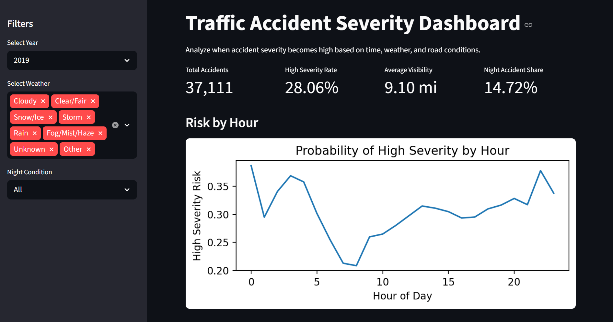
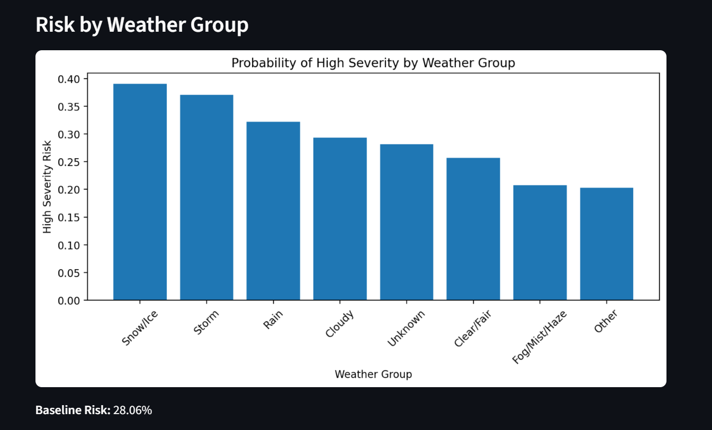
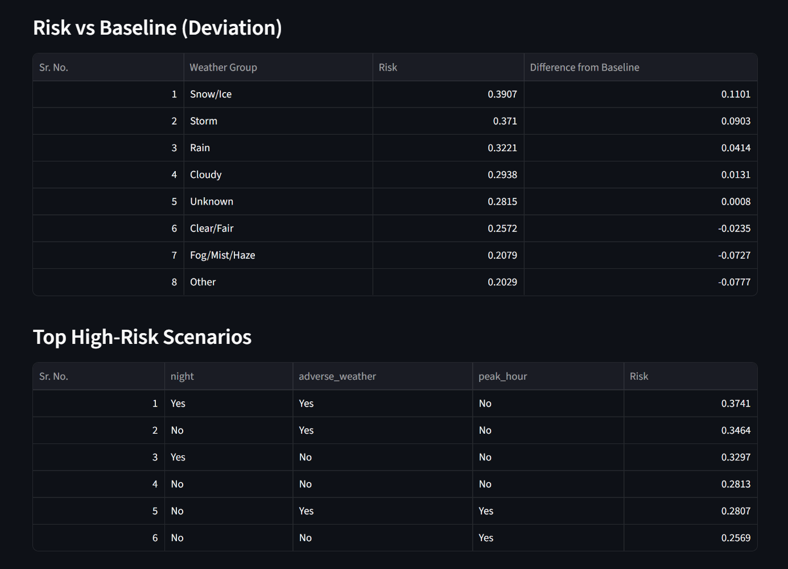
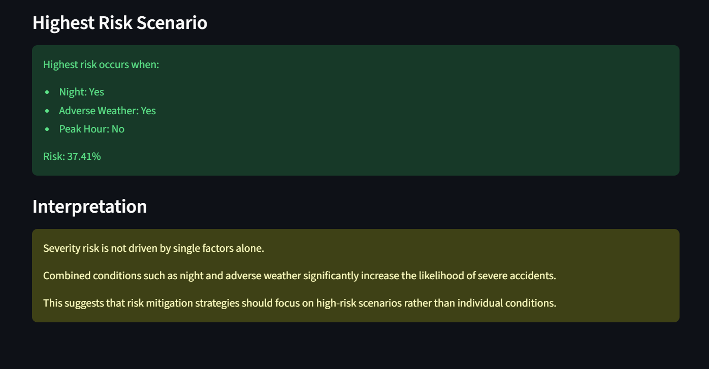

# Traffic Accident Severity Analysis & Risk-Based Scenario Detection (2019–2023)

## Overview

This project analyzes traffic accident data to identify **under what conditions accidents become severe**.

Rather than focusing on frequency or counts, the analysis is built around a **risk-based framework**, measuring the probability of high severity under different environmental and temporal conditions.

Using conditional probability, interaction analysis, and scenario evaluation, the study identifies **high-risk situations** that contribute to severe accidents.

The workflow integrates Python-based analytical modeling with a Streamlit dashboard to deliver both analytical depth and interactive exploration.

---

## Objectives

Evaluate accident severity distribution across conditions

Measure probability of high severity under time and environmental factors

Identify high-risk conditions such as night, weather, and visibility

Analyze interaction effects (combined conditions)

Detect and rank high-risk scenarios

Validate patterns using interpretable modeling

Develop an interactive dashboard for insight exploration

---

## Methodology

### 1. Data Preparation

Traffic accident dataset processed using Python (Pandas).

Relevant columns selected and cleaned.

Missing values handled for visibility and weather conditions.

Sample dataset created for efficient analysis.

---

### 2. Feature Engineering

Time-based features:
- Hour
- Day of week
- Month

Derived features:
- Night indicator
- Peak hour indicator
- Weather grouping
- Adverse weather flag

Binary target variable:
- High severity (Severity 3–4)
- Low severity (Severity 1–2)

---

### 3. Risk-Based Analysis

Baseline severity risk calculated.

Conditional probability computed across:
- Hour of day
- Weather conditions
- Night vs day

Deviation from baseline used to identify high-risk conditions.

---

### 4. Interaction Analysis

Combined condition analysis performed using:
- Night + weather
- Peak hour + weather
- Multi-condition combinations

Interaction effects used to detect **risk amplification patterns**.

---

### 5. Scenario Identification

High-risk scenarios ranked based on probability of severity.

Top combinations extracted to identify **worst-case conditions**.

Scenario-level insights used to move beyond single-variable analysis.

---

### 6. Modeling

Logistic regression model applied for interpretability.

Feature influence evaluated using model coefficients.

Focus on understanding drivers of severity rather than prediction accuracy.

---

### 7. Visualization Layer

Streamlit dashboard presents:

- KPI summary
- Risk by hour
- Risk by weather group
- Baseline comparison
- High-risk scenarios
- Key interpretation insights

---

## Key Insights

Accident severity is not driven by single factors alone.

Night conditions significantly increase severity risk compared to daytime.

Adverse weather conditions amplify risk further when combined with time factors.

Combined scenarios (e.g., night + adverse weather) show the highest severity probabilities.

Risk variation across hours indicates that severity is higher during late-night and early-hour periods.

Baseline comparison highlights that some conditions increase severity beyond normal levels, while others reduce it.

---

### Dashboard Visualizations

 







---

## Tools & Technologies

Python (Pandas, NumPy)   
Matplotlib  
Scikit-learn  
Streamlit  
Jupyter Notebook (VS Code)  
GitHub  

---

## Repository Structure

```text
Project - Accidents/
│
├── data/
│   ├── raw/
│   └── processed/
│       └── accidents_cleaned.csv
│
├── notebooks/
│   ├── 01_data_loading.ipynb
│   ├── 02_preprocessing.ipynb
│   ├── 03_risk_analysis.ipynb
│   └── 04_modeling.ipynb
│
├── dashboard/
│   └── app.py
│
├── outputs/
│   └── dashboard screenshots
│
├── requirements.txt
└── README.md
```
---

## Limitations

Analysis limited to selected features available in dataset.

No inclusion of driver behavior or vehicle-level variables.

Weather categorization is simplified into grouped labels.

Modeling is limited to interpretable baseline approach.

Results represent statistical relationships, not causal inference.

## Project Outcome

This project demonstrates end-to-end analytical capability:

Structured data preprocessing
Feature engineering and transformation
Risk-based analytical thinking
Interaction and scenario analysis
Interpretable modeling
Dashboard-based insight communication

It reflects a shift from descriptive analysis to decision-oriented risk evaluation, emphasizing how conditions combine to influence accident severity.
